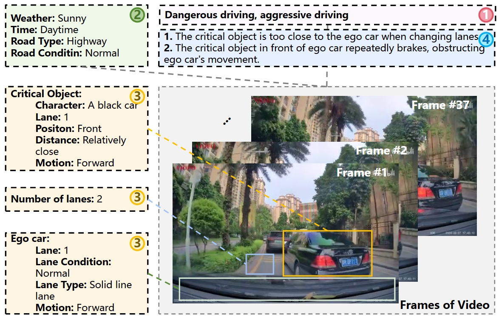
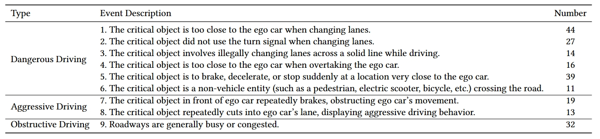
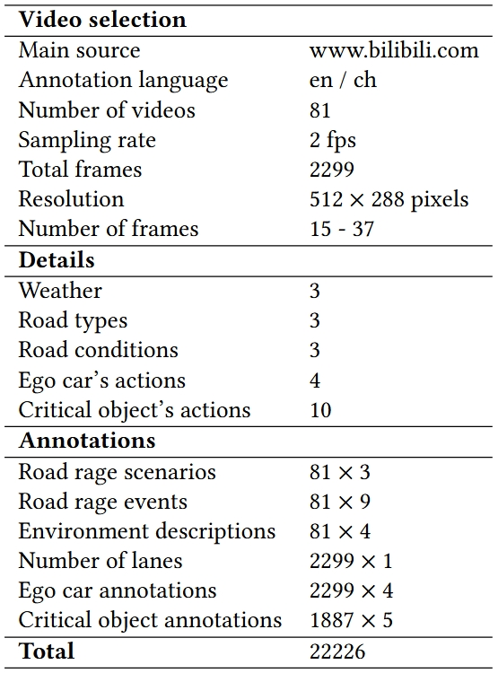

# INTRODUCTION
The **Road Rage Reasoning Dataset (Gu-RRR-v1)** is constructed by the I+ lab at the University of Electronic Science and Technology of China. The "Gu-RRR-v1" dataset contains multiple external driving events recorded by dashcams, which pose dangers, provocations, or obstacles to the current vehicle, thereby eliciting varying degrees of anger in drivers.

The entire dataset comprises 81 videos (sampled at 2 frames per second, resulting in 2,299 images), covering 3 types of road rage scenarios and 9 types of road rage behaviors. The annotation information includes weather conditions, road types, road conditions, and more. Additionally, the dataset annotates the current vehicle and key targets (including pedestrians and vehicles) in the video that trigger anger, with detailed descriptions of actions and positions provided frame by frame.

<!--  -->

The Gu-RRR-v1 dataset is now available for academic purposes only, distributed on a case-by-case basis. The I+ Lab at the University of Electronic Science and Technology of China serves as the constructor and distributor of the dataset and retains the copyright of all videos and images within the dataset. Any researcher requesting access to the Gu-RRR-v1 dataset must sign this agreement and thereby agrees to adhere to the restrictions outlined in this document.

# DATASET STATISTIC

**Overview:**

<!--  -->

**Environment Description:**
  - weather: sunny, rainy, unknow.
  - time: daytime, night, unknow.
  - road type: highway, city road, township road.
  - road condition: normal, busy, congested.

**Object Description:**
  - number of lanes: integer.
  - ego lane number: integer.
  - ego lane condiiton: normal, congested.
  - ego lane type: dashed lane, solid lane, dashed-solid lane, solid-dashed lane.
  - **ego motions:** forward, stop, go ahead to the left, go ahead to the right.
  - critical object description: like white car, red van, electric car, pedestrian and so on.
  - critical object lane number: integer.
  - critical object relative position: left, right, front, left front, right front.
  - critical object distance: normal (safe distance to drive), relatively close (requires increased attention), dangerous (approaching or already in a collision).
  - **critical object motions** can be described as (It can be a free combination of the following meta-actions. For vehicle, you need to describe them using genneral motions, vehicle motions and vehicle signals. For non-vehicle entity, you need to describe them using general motions and other motions):
    - general motions: forward, slow down, stop, go ahead to the left, go ahead to the right.
    - vehicle motions: overtake, pull into ego lane to the left, pull into ego lane to the right.
    - vehicle signals: no turn signal, brake.
    - other motions: crossing the street from left to right, crossing the street from right to left. 

# LICENSE

*  The videos, images, and corresponding annotation results can only be used for **ACADEMIC PURPOSES. NO COMMERCIAL USE** is allowed.
*  Copyright © I+ Lab, University of Electronic Science and Technology of China (UESTC). All rights reserved.

# DOWNLOAD

You can download the agreement (pdf) from [here](./Gu-RRR-v1-AGREEMENT.pdf). After filling it, please send the electrical version to our Email: 202411081538@std.uestc.edu.cn (Subject: Gu-RRR-v1-Agreement) .

Please send it through **an academic or institute email-addresses** such as xxx at xxx.edu.xx. Requests from free email addresses (outlook, gmail, qq etc) will be kindly refused.

After confirming your information, we will send the download link and password to you via Email. You need to follow the agreement.

Usually we will reply in a week. But sometimes the mail does not arrive and display successfully for some unknown reason. If this happened, please change the content or title and try sending again.

